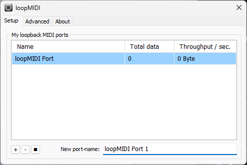
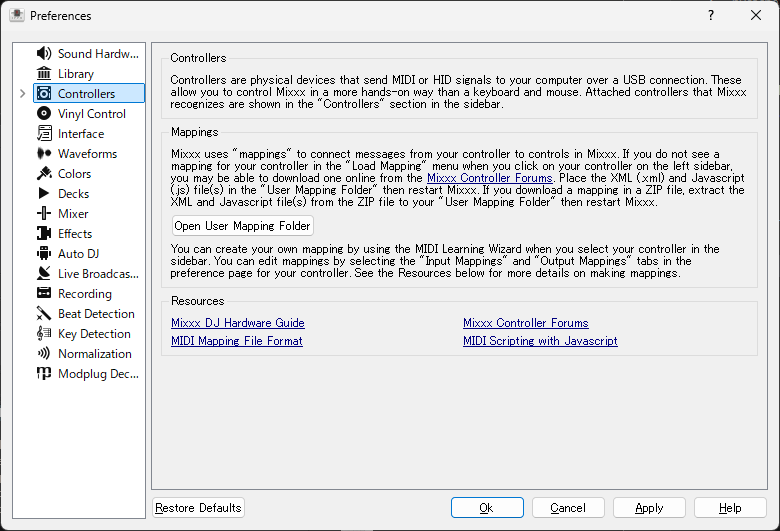
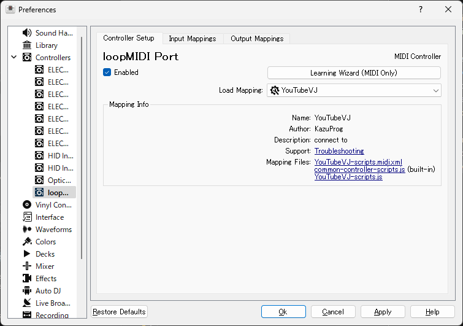
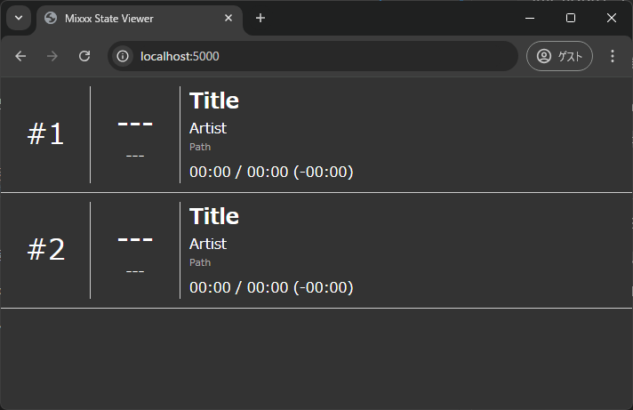
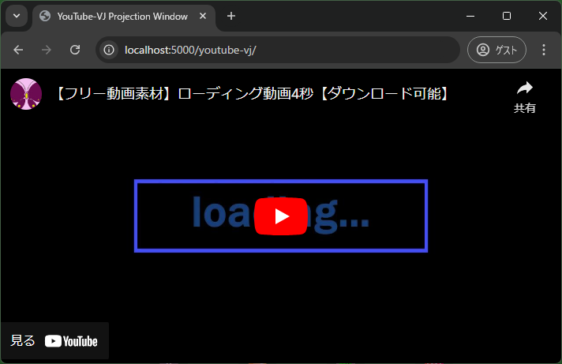

# Connect Mixxx and YouTube-VJ

Mixxx と YouTube-VJ をうまく連携させて簡単に VDJ ができないか試行錯誤

いろいろ無理やり実装しているので、動作の保証はしません

## Introduction

- 本プロジェクトは **Windows 専用**
- 以下のソフトウェアを事前にインストールしておく
  - [Python](https://www.python.org/downloads/)
  - [loopMIDI](https://www.tobias-erichsen.de/software/loopmidi.html)等の仮想 MIDI
- あらかじめ音声ファイルに`YouTubeID`タグを書き込んでおく必要あり
- また、Mixxx のライブラリに楽曲を登録しておく

## Program Description

本プログラムは大きく 2 つのプログラムで実現している

- `mixxx-controller-script`
  - Mixxx に読み込ませるコントローラースクリプト
  - 再生中の BPM や長さ、再生位置等を取得し、デバッグ出力経由で値を`mixxx-launcher`に送っている
- `mixxx-launcher`
  - Mixxx を開発者モードで起動させ、`mixxx-controller-script`のデバッグ出力を受け取る
  - また、受け取った情報をブラウザで表示させるための HTTP サーバも担っている

## How to execute

### Install loopMIDI

`mixxx-controller-script`を実行させるために、仮想 MIDI コントローラーが必要なので、loopMIDI 等でポートを作成しておく



### Load Mapping

Mixxx を起動させ、`Options` -> `Preferences`から設定画面を開き、`Controllers`の`Open User Mapping Folder`ボタンをクリックし、開いたフォルダに`mixxx-controller-script`の中に入っている 2 つのファイルをコピーする



Mixxx を再起動させ、`Controllers`に先ほど loopMIDI で設定したポートを選択し`Load Mapping`に YouTubeVJ を選択する



### Run mixxx-launcher

`mixxx-launcher`に必要なパッケージを pip でインストールし、実行する

```
cd mixxx-launcher
pip install -r requirements.txt
python main.py
```

起動すると、Mixxx が開発者モードで起動する

### View Playing State

ブラウザで`http://localhost:5000`へアクセスすると、再生情報等が閲覧できる



### Open YouTube Projection

ブラウザで`http://localhost:5000/youtube-vj/`へアクセスすると、`YouTube-VJ`の投影画面が閲覧できる


